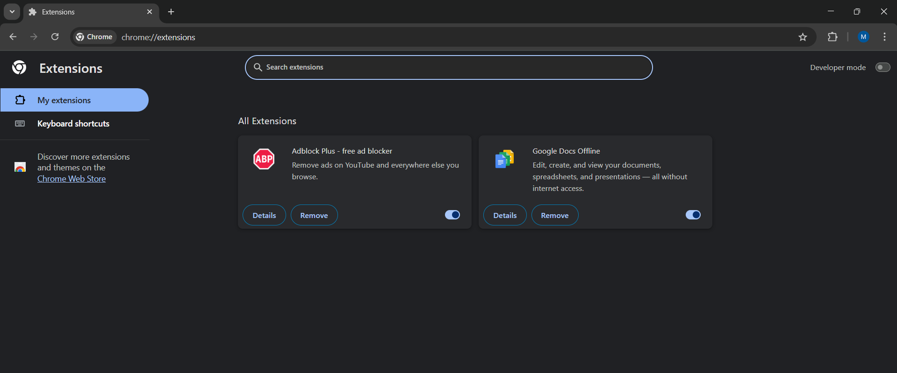
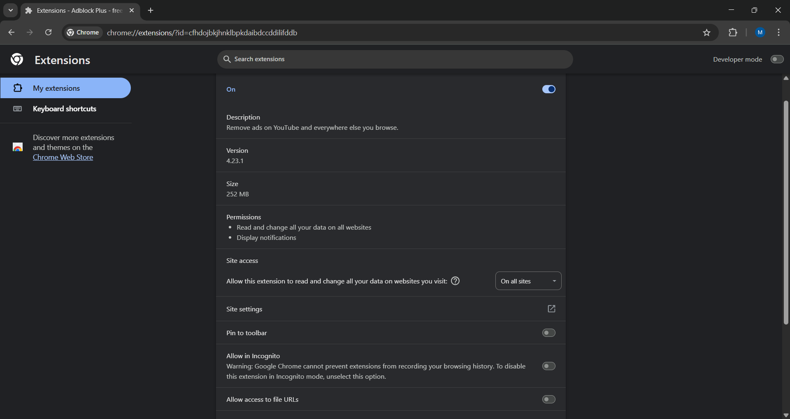

# Task 7: Identify and Remove Suspicious Browser Extensions

## 👨‍💻 Objective
Review and manage installed browser extensions to identify and remove any suspicious or unnecessary ones, and learn about browser security risks.

---

## 🔎 Extensions Reviewed

| Extension Name       | Publisher  | Version | Size     | Permissions                                  | Suspicious? | Action Taken |
|----------------------|------------|---------|----------|---------------------------------------------|-------------|--------------|
| Adblock Plus         | Eyeo GmbH  | 4.23.1  | 252 MB   | Read/change data on all sites; notifications | ❌ No       | Kept         |
| Google Docs Offline  | Google     | 1.93.1  | < 1 MB   | Read/change data only on Google Docs/Drive   | ❌ No       | Kept         |

---

## 📌 Steps Taken
1. Opened Chrome’s Extensions manager at `chrome://extensions/`.
2. Reviewed installed extensions and checked their details, permissions, and source.
3. Found two extensions installed: Adblock Plus and Google Docs Offline.
4. Verified Adblock Plus permissions:
   - **Read/change all data on all websites** and **display notifications**.
   - Installed from the official Chrome Web Store.
   - No suspicious behavior observed.
5. Verified Google Docs Offline permissions:
   - Access limited to `docs.google.com` and `drive.google.com`.
   - Official extension from Google.
   - No suspicious behavior observed.
6. Decided both extensions were legitimate and kept them.
7. Restarted the browser to confirm everything was working fine.

---

## 📚 Research: How Malicious Extensions Can Harm Users
- **Data Theft**: Malicious extensions can steal passwords, credit card numbers, or sensitive data.
- **Ad Injection**: They can insert unwanted ads or redirect you to malicious sites.
- **Browser Hijacking**: Change your homepage or search engine without consent.
- **Cryptojacking**: Use your computer’s CPU to mine cryptocurrency secretly.

**Best practices**:
✅ Always install extensions from official sources.  
✅ Review permissions carefully; unnecessary broad permissions should raise suspicion.  
✅ Keep extensions updated automatically.  
✅ Remove extensions you no longer use.

---

## 📝 Outcome
- Learned how to identify and evaluate browser extensions for potential security risks.
- Verified the safety of currently installed extensions.
- Gained awareness of threats from malicious browser extensions.

---

## 📸 Screenshots

### 🔹 Extensions Overview

### 🔹 Adblock Plus Details

### 🔹 Google Docs Offline Details

---

## 🗨️ Interview Questions & Answers

**1️⃣ How can browser extensions pose security risks?**  
Browser extensions can read and modify web pages you visit, capture keystrokes, track your browsing history, or inject malicious scripts. If compromised or malicious, they can steal data, hijack browsing, or install malware.

**2️⃣ What permissions should raise suspicion?**  
Permissions like:
- “Read and change all your data on all websites”
- “Access your clipboard”
- “Manage downloads”
- “Read and change browser settings”
Especially if these permissions are unnecessary for the extension’s function.

**3️⃣ How to safely install browser extensions?**  
✅ Install only from official browser stores (Chrome Web Store, Firefox Add-ons).  
✅ Check ratings, reviews, and publisher details.  
❌ Avoid extensions from unknown or suspicious developers.

**4️⃣ What is extension sandboxing?**  
Extension sandboxing isolates an extension’s processes from the main browser and system, limiting its ability to affect the browser or operating system if compromised.

**5️⃣ Can extensions steal passwords?**  
Yes. If an extension can read page contents or intercept input fields, it can capture passwords or sensitive data entered by the user.

**6️⃣ How to update extensions securely?**  
- Keep automatic updates enabled in your browser.
- Update extensions only through official browser stores.
- Never install updates from unknown or third-party websites.

**7️⃣ Difference between extensions and plugins?**  
- **Extensions**: Modify or extend browser features; run inside the browser.
- **Plugins**: (largely obsolete) External programs that enable specific content types like Flash or Java, often with less security isolation.

**8️⃣ How to report malicious extensions?**  
- **Chrome**: Go to the extension’s page in the Chrome Web Store → Click “Report abuse.”
- **Firefox**: Go to the extension’s page in Mozilla Add-ons → Click “Report this add-on.”
- Or contact the browser’s official support team directly.

---

